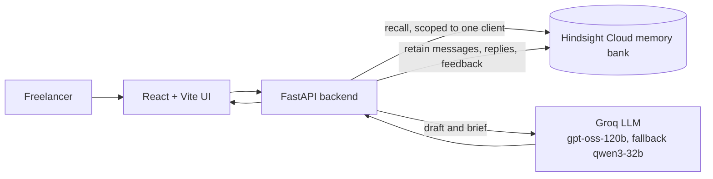

# Rapport

**A client-memory agent for freelancers and consultants that remembers every client's preferences, decisions and history, so you never re-ask "what did we agree on?"**

Powered by [Hindsight](https://github.com/vectorize-io/hindsight) (agent memory by Vectorize).

> **Status: under active development.** Sections marked *(planned)* describe the target design and will be updated as features land.

---

## The problem

Freelancers juggle several clients across scattered email threads, calls and invoices. Each client has quirks: preferred channel, best call times, how they handle scope changes, how late they pay. Keeping all of it in your head does not scale, and generic AI drafts ignore it.

## What Rapport does

1. Pick a client and paste a new incoming message (email, chat or call notes).
2. Rapport recalls that client's history from long-term memory.
3. It returns a draft reply, a short client brief, and risk flags, each citing the past interaction it came from.
4. You send the reply, then mark how it went (went well / pushback).
5. Everything is stored, so the next draft is better.

## Key features *(planned)*

- **Memory ON / OFF comparison:** the same message answered generically and with memory, side by side.
- **Memory panel:** shows what was recalled and why it matched.
- **Per-client profiles:** consolidated observations built from each client's own history.
- **Strict client isolation:** one client's memories never leak into another's.
- **Preference changes:** when a client changes a preference (for example, email to Slack), the current one wins and the change is noted.
- **Learning curve:** measured draft quality at interactions 1, 5 and 20, against a memory-off baseline.
- **Import history:** paste old threads or notes and Rapport retains them.

## Architecture *(planned)*



## Tech stack

| Layer | Choice |
|---|---|
| Backend | Python, FastAPI, Pydantic |
| Frontend | React (Vite), TypeScript, Tailwind CSS |
| LLM | Groq: `openai/gpt-oss-120b` (fallback `qwen/qwen3-32b`) |
| Memory | Hindsight Cloud via the official `hindsight-client` SDK |

## How Hindsight memory is used *(planned)*

- **`retain`:** every message, reply and feedback item is stored with a descriptive `context`, its real `timestamp`, a stable `document_id`, and a `client:<id>` tag.
- **`recall`:** each incoming message is the query, restricted to the selected client with strict tag matching so untagged or other-client memories are excluded.
- **Observations:** Hindsight consolidates repeated behaviour (for example, "pays about 20 days late") into per-client observations that refine as new evidence arrives.
- **Feedback loop:** "went well" and "pushback" outcomes are retained, so future drafts learn what works for that client.

## Getting started *(planned)*

You will need a Hindsight Cloud API key and a Groq API key.

```bash
git clone https://github.com/<your-username>/rapport-client-memory.git
cd rapport-client-memory
cp .env.example .env    # then fill in HINDSIGHT_API_KEY and GROQ_API_KEY
```

Backend, frontend and seed-script commands will be added here once the first build lands.

## Demo data

All clients, messages and invoices in this repository are **synthetic**, with invented names, companies and amounts. They do not describe real people or businesses.

## Limitations *(planned)*

- Seed data is synthetic and the learning-curve evaluation uses one simulated client, so results show the mechanism, not real-world accuracy.
- Feedback in the evaluation is simulated.
- LLM output varies between runs.

## Acknowledgements

Built on [Hindsight](https://github.com/vectorize-io/hindsight) by [Vectorize](https://vectorize.io). Docs: <https://hindsight.vectorize.io>

## License

MIT
